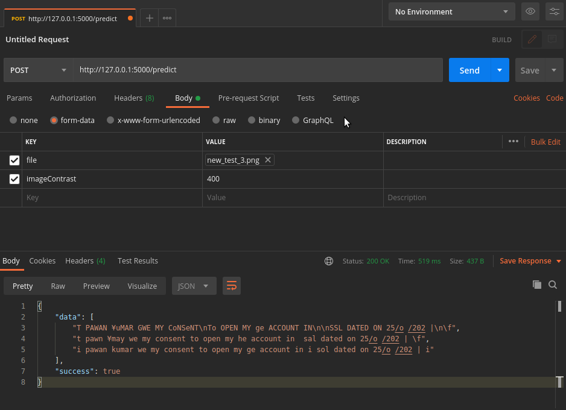

# How to run the code

## Installations

```
pip install -r requirements.txt
```

<hr/>

```
sudo apt-get install tesseract-ocr
sudo apt-get install imagemagick
```

## Image size recommendations

- Works well on sizes like 1000x1000
- If doesn't work in test.py there is a parameter which changes the contrast change it to 100 or 1000 from 400 in order to obtain best results

## Running the server

```
python app.py
```

- A sample request is as follows



## Testing different images

- You can change line 16 of the test.py file for testing different images

```
python test.py
```
